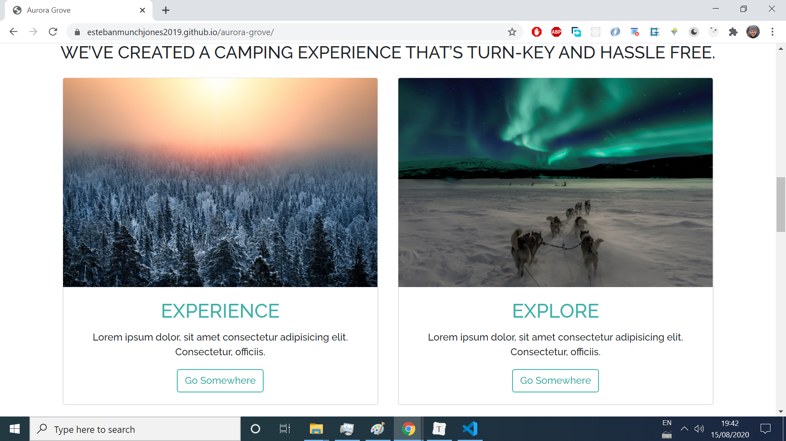

# Aurora Grove
> A mobile responsive landing page beautifully crafted with [Bootstrap 4](https://getbootstrap.com/docs/4.0/getting-started/introduction/). Live project: https://estebanmunchjones2019.github.io/aurora-grove/.

## Table of contents

* [General info](#general-info)
* [Screenshots](#screenshots)
* [Technologies](#technologies)
* [Setup](#setup)
* [Features](#features)
* [Status](#status)
* [Inspiration](#inspiration)
* [Contact](#contact)

## General info

This project was coded to learn [Bootstrap 4](https://getbootstrap.com/docs/4.0/getting-started/introduction/),  the world’s most popular framework for building responsive and mobile-first sites.

## Screenshots

## Technologies

*  [Bootstrap 4](https://getbootstrap.com/docs/4.0/getting-started/introduction/)

## Setup

* **Clone or download the repo.**

* Open `index.html` file in with your favorite browser and you're good to go.

  

## Features
List of implemented features:
* Mobile Responsive
* Customization of Bootstrap default styles.
* Modal
* Backdrop
* Form
* Carousel

List of improvements that could be done:

* Form validation
* Change the style of the footer links on mouse hovering.

## Status
Project is _finished_. 

## Inspiration

This project was based on [The Bootstrap 4 Bootcamp](https://www.udemy.com/course/bootstrap-4-bootcamp/) course.

## Contact

Created by [Esteban Munch Jones](https://www.linkedin.com/in/estebanmunchjones/)- feel free to contact me.

